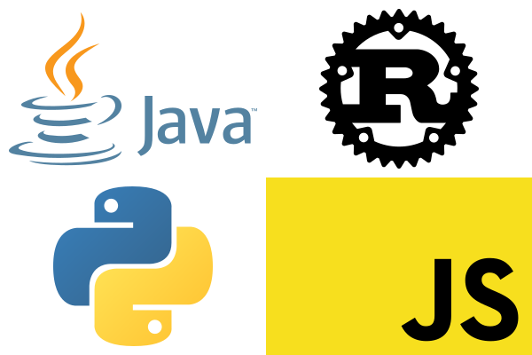

# Language Comparisons



In this repo I have a few different projects (2 at the moment) which are written in four different languages each: javascript, java, python, and rust, the four languages I know.

In this readme, I will first outline what each of the two projects is, and then I will describe the challenges I faced creating the projects in each language. Keep in mind that these projects are small and fairly simple, to make it easy to transpile them.

## Projects

In this section I will outline exactly what each project does, without using any code, only a description of the actual behavior.

### Guessing Game

This project is from chapter 2 of [*The Rust Programming Language*](https://doc.rust-lang.org/book/ch02-00-guessing-game-tutorial.html), which walks a new rust programmer through how to create a simple command line guessing game in rust. This rust code is what I used as my template, the other three languages were based on my rust program.

This is a command line based version of a simple number guessing game. The program picks a random number in a range, and the user tries to guess the number. After each guess, the program responds whether the guess was too large, too small, or accurate. An example game would be

```shell
  Lets play guess the number!
  The game will get harder with each round, so don't leave if the first round's too easy!
  I'm thinking of a number between 1 and 10
  Please input your guess.
> 5
  Too large
  Please input your guess.
> 2
  Too small
  Please input your guess.
> 3
  You win!
  Do you want to play again? (y/n)
> n
  Thanks for playing!
```

If you entered `y` instead, there would be a second round, this time with a number between 1 and 100. The game continues, going through powers of 10, the last round being from 1 and 10<sup>9</sup> (1 billion). Rounds beyond this point would not work with 32-bit integers, and while I could use 64 bit, no one is realistically going to want to play past this point.

If you were to enter something that isn't a number, it prints `<yourInput> is not a number`.

### Magic 8 Ball

This program replicates the behavior of a magic 8 ball. If you've never used one, it is usually a large ball with the same design of an 8-ball from pool. It is filled with fluid and a 20-sided die. You ask a question, shake the ball, and one side of the die presses against the window at the bottom of the ball, revealing one of the following answers:

- It is certain.
- It is decidedly so.
- Without a doubt.
- Yes – definitely.
- You may rely on it.
- As I see it, yes.
- Most likely.
- Outlook good.
- Yes.
- Signs point to yes.
- Reply hazy, try again.
- Ask again later.
- Better not tell you now.
- Cannot predict now.
- Concentrate and ask again.
- Don't count on it.
- My reply is no.
- My sources say no.
- Outlook not so good.
- Very doubtful.

The outcome is completely random, what the user asks has no effect on the program.

One important but easily overlooked part of the program is that if the user doesn't enter a question, I don't want to provide an answer. This means not printing and answer if the line of input consists of entirely whitespace.

## Languages

*This is unfinished. This section will compare the four languages overall, and then there will be a third section that goes over how I completed each project in each of the different languages*